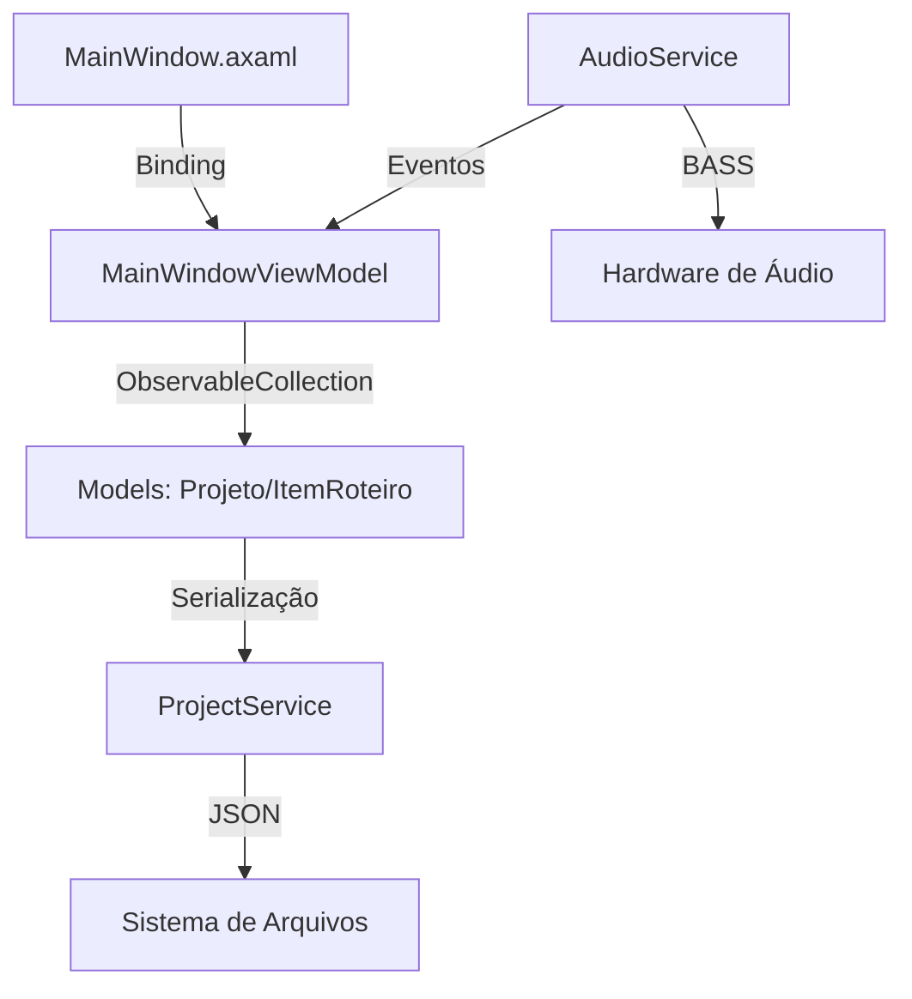

# GravadorMulti - Project Bible

> **Última Atualização**: 26/02/2026  
> **Versão do Projeto**: 2.0  
> **Propósito**: Guia definitivo para desenvolvimento e manutenção

---

## 1. Visão Geral do Projeto

### 1.1 Descrição
**GravadorMulti** é uma aplicação desktop de gravação multi-track para produção de voiceover/dublagem. Permite:
- Gravar áudio sincronizado com roteiro de texto
- Visualizar ondas de áudio em tempo real
- Gerenciar múltiplos projetos em abas
- Editar e organizar frases de roteiro
- Exportar mixagens de áudio

### 1.2 Stack Tecnológico
| Componente | Versão | Propósito |
|------------|--------|-----------|
| .NET | 9.0 | Runtime principal |
| Avalonia UI | 11.3.10 | Framework de UI cross-platform |
| ManagedBass | 3.1.1 | Wrapper .NET para a biblioteca de áudio BASS |
| Newtonsoft.Json | 13.0.4 | Serialização de projetos |
| bass.dll | 2.4 | Biblioteca nativa de gravação/reprodução multi-track |

### 1.3 Estrutura de Diretórios
```
GravadorMulti/
├── App.axaml              # Entry point da aplicação
├── App.axaml.cs           # Inicialização do App
├── Program.cs             # Entry point do programa
├── MainWindow.axaml       # UI principal (XAML)
├── MainWindow.axaml.cs    # Code-behind principal (~1100 linhas)
├── GravadorMulti.csproj   # Configuração do projeto
├── README.md              # Documentação GitHub
├── Services/              # Camada de serviços
│   ├── AudioService.cs    # Engine de áudio (ManagedBass)
│   ├── ProjectService.cs  # CRUD de projetos JSON
│   └── WaveformUtils.cs   # Geração de waveforms
├── Models/                # Modelos de dados
│   ├── Projeto.cs         # Entidade principal do projeto
│   └── ItemRoteiro.cs     # Item individual do roteiro
├── Converters/            # Conversores de binding
│   ├── ProgressToPixelConverter.cs
│   ├── InverseProgressToPixelConverter.cs
│   └── BoolToBrushConverter.cs
└── Audios/                # Pasta de áudios de teste
```

---

## 2. Arquitetura do Sistema

### 2.1 Padrão de Arquitetura
O projeto utiliza um padrão **MVVM simplificado** com code-behind:
- **Model**: Classes em `/Models` (POCOs com INotifyPropertyChanged)
- **View**: Arquivos `.axaml` com bindings
- **ViewModel**: Classe `MainWindowViewModel` no code-behind

### 2.2 Fluxo de Dados


### 2.3 Componentes Principais

#### AudioService (Thread-Safe)
```csharp
// Responsabilidades:
- Inicialização BASS (dispositivos base + gravação)
- Captura de áudio (gravação via RecordProc callback)
- Reprodução de áudio (plays/pauses nativos via handles)
- Seeking exato em milisegundos
- Monitoramento de volume (VU Meter)
- Hotplug de dispositivos

// Trabalha internamente com:
- Callbacks GCHandle Pinned (RecordProcedure, SyncProcedure)
- _monitorThread (para o VU Meter leve)
- Callbacks assíncronos de fim de arquivo (SyncFlags.End)
```

#### MainWindowViewModel
```csharp
// Propriedades Críticas:
- ProjetosAbertos: ObservableCollection<Projeto>
- ProjetoSelecionado: Projeto
- DispositivosEntrada: ObservableCollection<string>
- NivelMicrofone: double (0.0 - 1.0)
```

---

## 3. Funcionalidades Detalhadas

### 3.1 Gerenciamento de Projetos

#### Estrutura de Pasta de Projeto
```
[NomeProjeto]/
├── projeto.json          # Metadados e roteiro
├── Audios/               # Arquivos .wav gravados
│   ├── Audio_1_xxx.wav
│   └── Audio_2_xxx.wav
└── Exports/              # Arquivos exportados
```

#### Formato JSON (projeto.json)
```json
{
  "Nome": "Meu Projeto",
  "CaminhoArquivoProjeto": "C:/.../projeto.json",
  "PastaRaiz": "C:/.../Meu Projeto",
  "PastaAudios": "C:/.../Meu Projeto/Audios",
  "PastaExports": "C:/.../Meu Projeto/Exports",
  "TextoRoteiro": "Linha 1\nLinha 2",
  "Itens": [
    {
      "Id": 1,
      "Texto": "Linha 1",
      "CaminhoArquivo": "...",
      "TemAudio": true,
      "Aprovado": false
    }
  ]
}
```

### 3.2 Sistema de Gravação

#### Estados de Gravação
| Estado | Descrição | Transição |
|--------|-----------|-----------|
| Idle | Aguardando | IniciarGravacao() |
| Recording | Gravando ativamente | PararGravacao() |
| Monitoring | Monitorando VU apenas | IniciarMonitoramento() |

#### Formato de Áudio
- **Codec**: PCM 16-bit Mono
- **Sample Rate**: 44100 Hz
- **Arquivo**: WAV com cabeçalho padrão
- **Streaming**: Gravação direta em disco (não RAM)

### 3.3 Visualização de Waveform

#### Tipos de Renderização
1. **Em tempo real** (durante gravação):
   - Usa `ConverterVolumesParaPontos()`
   - Atualização via `OnVolumeReceived` event
   
2. **Pós-gravação** (de arquivo):
   - Usa `GerarPontosDoArquivo()`
   - Leitura de bytes WAV manual

#### Cores de Estado do Item
| Estado | Cor | Hex |
|--------|-----|-----|
| Sem áudio | Cinza escuro | `#2B2B2B` |
| Com áudio | Azul profundo | `#1E3A5F` |
| Aprovado | Verde escuro | `#1E441E` |

### 3.4 Sistema de Undo/Redo

#### Implementação
```csharp
// Classe interna que garante simetria de ações
public class UndoCommand
{
    public Action DoAction { get; set; }
    public Action UndoAction { get; set; }
}

Stack<UndoCommand> _undoStack = new();
Stack<UndoCommand> _redoStack = new();

// Ações suportadas:
- Limpar áudio de item
- Registrar nova gravação
- Cortar/Trim áudio (não-destrutivo)
- Fatiar texto em itens
- Mover itens (cima/baixo)
- Excluir itens da lista

// Padrão de uso:
PushUndo(
    doAction: () => { /* ação direta */ },
    undoAction: () => { /* ação reversa */ }
);
```

### 3.5 Modo de Corte de Áudio

#### Funcionamento
- Ativado via menu de contexto ("Modo de Corte")
- Puxadores arrastáveis com hitbox ampliada (PathIcon SVG)
- Overlays escuras indicam áreas fora da seleção 
- Operação **não-destrutiva**: cria novo arquivo WAV com timestamp
- Suporta Undo/Redo completo (restaura arquivo anterior)

### 3.6 Interface Vetorial (PathIcon SVG)

Todos os ícones da UI usam `PathIcon` com dados de `StreamGeometry` (Material Design Icons), garantindo renderização nítida em qualquer DPI. Emojis foram completamente removidos.

### 3.7 Animações e Transições

- **Botões:** `BrushTransition` em `Background` (0.15s) e `DoubleTransition` em `Opacity` ao pressionar
- **ListBoxItem:** Hover com transição suave de background
- **Overlays modais:** Background semi-transparente com fade

### 3.8 Atalhos de Teclado

| Atalho | Ação | Contexto |
|--------|------|----------|
| `Ctrl+S` | Salvar projeto | Global |
| `Ctrl+Z` | Undo | Global |
| `Ctrl+Y` | Redo | Global |
| `Ctrl+Alt+Z` | Redo (alternativo) | Global |
| `Space` | Play/Pause | Item selecionado |
| `R` | Gravar/Parar | Item selecionado |
| `Delete` | Limpar áudio | Item selecionado |

---

## 4. Convenções de Código

### 4.1 Nomenclatura
| Elemento | Convenção | Exemplo |
|----------|-----------|---------|
| Classes | PascalCase | `AudioService` |
| Métodos | PascalCase | `IniciarGravacao()` |
| Propriedades | PascalCase | `NivelMicrofone` |
| Campos privados | _camelCase | `_isRecording` |
| Constantes | PascalCase | `SAMPLE_RATE` |
| Eventos | On + PascalCase | `OnVolumeReceived` |

### 4.2 Organização de Arquivos
```csharp
// Ordem de membros em classes:
1. Constants/Enums
2. Private fields
3. Public properties
4. Events
5. Constructor
6. Public methods
7. Private methods
8. IDisposable
```

### 4.3 Thread Safety
```csharp
// Sempre use Dispatcher.UIThread para atualizar UI:
_audioService.OnVolumeReceived += (vol) => {
    Dispatcher.UIThread.Invoke(() => {
        _vm.NivelMicrofone = vol;
    });
};
```

### 4.4 Error Handling
```csharp
// Padrão de proteção em inicialização:
try {
    _audioService = new AudioService();
} catch (Exception ex) {
    Console.WriteLine($"ERRO FATAL AUDIO: {ex.Message}");
}
```

---

## 5. Guia de Modificações

### 5.1 Adicionando Nova Funcionalidade de Áudio

1. **Adicione métodos em `AudioService.cs`**:
   ```csharp
   public void NovaFuncao() {
       // Verifique estado atual
       if (_isRecording) return;
       
       // Implementação...
   }
   ```

2. **Exponha eventos se necessário**:
   ```csharp
   public event Action? OnNovoEvento;
   ```

3. **Atualize `MainWindow.axaml.cs`**:
   - Adicione handler no `SetupAudioEvents()`
   - Crie método de UI no code-behind

### 5.2 Modificando a UI

1. **XAML**: Edite `MainWindow.axaml`
   - Use classes de estilo existentes quando possível
   - Cores do tema:
     - Fundo principal: `#121212`
     - Fundo secundário: `#1E1E1E`
     - Ação primária: `#2D63C8`
     - Ação hover: `#3A75DF`

2. **Code-Behind**: Adicione handlers em `MainWindow.axaml.cs`
   ```csharp
   private void NovoBotao_Click(object sender, RoutedEventArgs e) {
       e.Handled = true; // Sempre use!
       // Lógica...
   }
   ```

### 5.3 Adicionando Propriedade ao Modelo

1. Em `Models/ItemRoteiro.cs` ou `Projeto.cs`:
   ```csharp
   private Tipo _novaPropriedade;
   public Tipo NovaPropriedade {
       get => _novaPropriedade;
       set {
           _novaPropriedade = value;
           OnPropertyChanged(nameof(NovaPropriedade));
           // Atualize TemAlteracoesNaoSalvas se necessário
       }
   }
   ```

2. Se persistir no JSON, marque com `[JsonIgnore]` se for temporário

### 5.4 Adicionando Atalho de Teclado

1. No método `OnWindow_KeyDown`:
   ```csharp
   if (isCtrl && e.Key == Key.N) {
       NovaFuncao();
       e.Handled = true;
       return;
   }
   ```

---

## 6. Pontos de Atenção Críticos

### 6.1 Gerenciamento de Threads
- **NUNCA** acesse UI diretamente de threads do AudioService
- Sempre use `Dispatcher.UIThread.Invoke()`
- Threads de monitoramento têm `while` loops - verifique flags de controle

### 6.2 BASS e Dispositivos
- Dispositivos USB de áudio podem ser desconectados a qualquer momento.
- Sistema de hotplug (`VerificarNovosDispositivos()`) verifica via hash IDs a cada 1s.
- Não invoque callbacks não-gerenciados contendo `SyncFlags.Mixtime` (causa crash).

### 6.3 Estado de Playback
- `_estaTocando` (bool local) vs `Bass.ChannelIsActive()`
- Sincronize `_itemTocando` com o item atual no WPF.
- O BASS já sabe a cada momento os bytes exatos e gerencia o cursor; evite polling agressivo se os métodos `GetPosition` bastam.

### 6.4 Memory Management
- O Garbage Collector coletará Callbacks P/Invoke se não forem armazenados em campos da classe! SEMPRE crie os `RecordProcedure` e `SyncProcedure` e salve-os em um `private field`.
- `AudioService` implementa `IDisposable` e o destrutor defende `Bass.Free()`.
- Handlers do BASS precisam passar por `Bass.StreamFree` e `Bass.RecordFree`.

---

## 7. Checklist de Testes

Antes de commitar mudanças, verifique:

- [ ] Gravação inicia/para corretamente
- [ ] Playback funciona com pause/resume
- [ ] Waveform desenha em tempo real e de arquivo
- [ ] Salvar/Carregar projeto preserva dados
- [ ] Undo/Redo funcionam para áudio
- [ ] Atalhos de teclado respondem
- [ ] Dispositivo de áudio pode ser trocado
- [ ] Fechar com alterações não salvas mostra diálogo
- [ ] Scrubbing (clique na waveform) funciona
- [ ] Fatiar texto mantém áudios existentes

---

## 8. Referências Rápidas

### 8.1 Configurações do Projeto (.csproj)
```xml
<AvaloniaUseCompiledBindingsByDefault>true</AvaloniaUseCompiledBindingsByDefault>
<!-- O bass.dll (x64) DEVE estar marcado para CopyToOutputDirectory -->
```

### 8.2 Eventos do AudioService
| Evento | Gatilho | Handler Típico |
|--------|---------|----------------|
| OnVolumeReceived | Volume capturado | Atualizar VU meter |
| OnRecordingStopped | Gravação finalizada | Gerar waveform, salvar |
| OnPlaybackStopped | Áudio terminou/parou | Resetar ícones |

### 8.3 Constantes Importantes
```csharp
SAMPLE_RATE = 44100;        // Hz
BUFFER_SIZE = 4410;         // ~100ms
LARGURA_ONDA_DESENHO = 800; // pixels
```

---

## 9. Solução de Problemas Comuns

### 9.1 "BASS not found" / "DllNotFoundException"
- Verifique se o `bass.dll` nativo está na raiz da pasta `/bin/Debug/net9.0`.
- É obrigatório que a arquitetura do build (x64 vs x86) case com a DLL inserida.

### 9.2 "ArgumentNullException at System.GC.RunFinalizers()" ou crash nativo repentino
- O código do ManagedBass acionou um callback num método nativo, mas a memória onde estava o callback C# foi coletada pelo GC.
- Definição do delegate deve ser um membro fixo da classe. Nunca passe 'method groups' diretamente aos ponteiros P/Invoke (e.g `Bass.RecordStart(..., RecordProc)`).

### 9.3 "WAV file corrupted"
- Verifique se `AtualizarTamanhoCabecalhoWav()` foi chamado
- Não interrompa gravação abruptamente (use flags)

### 9.4 "Binding not working"
- Verifique se `x:DataType` está definido no XAML
- Confirme que `INotifyPropertyChanged` está implementado
- Verifique se `DataContext` foi setado

---

## 10. Roadmap Sugerido

### Prioridade Alta
- [x] Implementar trim/crop de áudio não-destrutivo
- [x] Sistema global de Undo/Redo (Ctrl+Z / Ctrl+Y)
- [x] Ícones vetoriais SVG (PathIcon)
- [ ] Implementar `ExportarMixagem` completo
- [ ] Suporte a múltiplas takes por frase

### Prioridade Média
- [ ] Configurações de projeto (sample rate, etc)
- [ ] Tema claro/escuro
- [ ] Atalhos configuráveis
- [ ] Suporte a Linux e macOS

### Prioridade Baixa
- [ ] Plugin system para efeitos
- [ ] Sincronização cloud
- [ ] Suporte a vídeo (lip sync)
- [ ] Testes automatizados

---

**Fim do Documento**

> Este documento deve ser atualizado sempre que:
> - Novas dependências forem adicionadas
> - Padrões de arquitetura mudarem
> - Novas funcionalidades críticas forem implementadas
